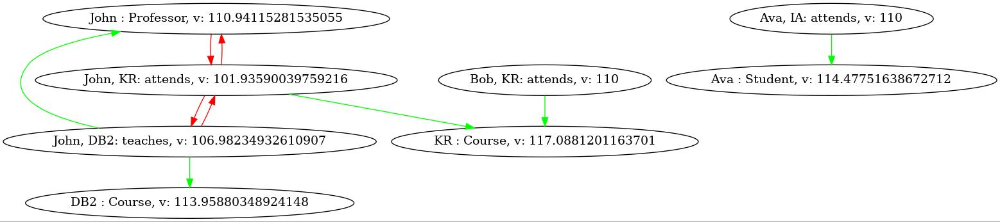

# rustoner: a Description Logic reasoner written in rust
**it works now**

## Description 

[Description Logics](http://dl.kr.org) allow for fast and accurate reasoner systems. 
It is the main objective of DLs.
They are the theoric base for [Semantic Web.](https://en.wikipedia.org/wiki/Semantic_Web)
This project has a first objective to implement in [rust](https://www.rust-lang.org/) a reasoner for the simple logic
[dl_lite_r](https://link.springer.com/article/10.1007/s10817-007-9078-x).


DLs works like model theory, where you have axioms (that we put in a __TBox__) and also some 
grounded knowledge
(that we put in __ABoxes__).
From this you can, under the limitations of the logic that you use (*dl_lite_r* here), ask
questions (queries), know if there are problems in your data (consistency verification) and sometimes ask
for implicit information in your data (reason and inference).

### Why
There are already several __DL__ reasoners, even for more complex logics than *dl_line_r*,
you can go [here](http://owl.cs.manchester.ac.uk/tools/list-of-reasoners/) for a 
(non exhaustive) list of them.
The objective of this reasoner is to implement quantification of inconsistency.
Mainly this work: [Logic-Based Ranking of Assertions inInconsistent ABoxes](http://ceur-ws.org/Vol-2663/paper-20.pdf).

### What for
This tool is thought to be used as a **backend** to generate rankings for inconsistent 
knowledge bases and _pipelined_ in more complex systems.
Nevertheless you can play with it and even generate conflict graphs for exploratory 
analysis.


## Use

### Notation

While support is being added for other syntax, the more easy one is the native one.
To declare a tbox write a file (for example) __are_me_mortals__:
```
// this file is: are_men_mortals
BEGINSYMBOL
concept : Man // concepts are unary relations
concept : Human
concept : Mortal
concept : Chicken
role : eats // and roles are binary relations (that we don't use in this really simple example)
ENDSYMBOL // you can put a comment here if you want

BEGINTBOX
Man < Human
Human < Mortal
Chicken < Mortal
Human < NOT Chicken // a human is NOT chicken
ENDTBOX
```

This tbox says that a man is a human, a human is a mortal, a chicken is also mortal and 
that human are not chickens.
You begin by declaring the symbols that use and their type:
```
concept: Human
```
all symbols declaration must be between ```BEGINSYMBOL``` and ```ENDSYMBOL```
clauses.
The axioms are between ``BEGINTBOX`` and ```ENDTBOX``` clauses.
To declare subsumption simply use ```<```. You can also use ```=``` to denote 
equivalence, for example to say that a fish is the same thing that a
_poisson_ (fish in french), you can write ```Fish = Poisson```,
note that this is nothing more than a shorcut for 
```
Fish < Poisson
Poisson < Fish
```

You can go see this paper
[Tractable Reasoning and Efficient Query Answeringin Description Logics: The DL-Lite Family](https://link.springer.com/content/pdf/10.1007/s10817-007-9078-x.pdf)
for fully detailed definition of __DL-lite__ (here we use the extension __DL-lite_r__).
Resuming: 
- if ```Mortal``` is a __concept__ symbol then
  ```
    Mortal
    NOT Mortal
  ```
  are valid declarations
- if ```eats``` is a __role__ symbol then
  ```
    eats
    INV eats // stands for the inverse relation
    NOT eats
    EXISTS eats
    EXISTS INV eats
  ```
  are valid declarations 
- you cannot have negation on the left hand of your axioms:
  ```
  NOT Chicken < Human // this is not good 
  Human < NOT Chicken // this is
  ```

#### ABox
The notation for aboxes is the same, only that, because aboxes are relative to a tbox,
no need for symbol declaration:
```
// this file is: a_man
BEGINABOX
Socrates: Man
Socrates, Apple: eats
ENDABOX
```
the notation should be self explanatory.


### Tasks

You have a variety of tasks:
- TBox related:
    - verify tbox: see if they are potentially contradictions in you axioms
    - generate tree: create tree where edges go from group of axioms to axioms implied by them
    - complete tbox: generate a tbox with no hidden implications
- ABox related:
  - verify abox: same as tbox, for here conflicts are not potential
  - clean abox: produce a new abox without self conflicting facts
  - complete abox
  - rank abox: produce a rank for the facts in the abox that should reflect their quality
    with respect to inner structure (given by the tbox) and an initial (optional)
    opinion coming from you

#### verify tbox

Suppose you have the following tbox:
```
// this file is: are_men_mortals_contradiction
BEGINSYMBOL
concept: Man
concept: Human
concept: Mortal
ENDSYMBOL

BEGINTBOX
Man < Human
Human < Mortal
Mortal < NOT Man
ENDTBOX
```

and you ask yourself if there is a problem.
Then you could do the follwing:
```commandline
./rustoner_dllite --task vertb --tbox are_men_mortals_contradiction 
```
where you specify the task __verify tbox__ with ```--task vertb``` and 
a the tbox file with ```--tbox are_men_mortals_contradiction```.
Then, after answering yes whenever asked, you should get the following output:
```commandline
 -- possible contradictions were found
 -- do you want to see the contradictions? (Y/n) 
{
  Man < NOT Man,
}
 -- do you want unravel for conflicts? (Y/n) 
[
  level 2: {
   {
     tbi: Man < NOT Man
     impliers: [Man < Mortal, Mortal < NOT Man, ]
               [Man < Human, Human < NOT Man, ]
     impliers 1
       {
         tbi: Man < Mortal
         impliers: [Man < Human, Human < Mortal, ]
       }
     impliers 2
       {
         tbi: Human < NOT Man
         impliers: [Mortal < NOT Man, Human < Mortal, ]
       }
   }
  },
]
```
and you can backtrack from where your (possible) contradiction came from, going back to
the original axioms.

#### generate tree
Same as before take the following tbox (the one from the initial example):
```
// this file is: are_men_mortals
BEGINSYMBOL
concept : Man // concept are unary relations
concept : Human
concept : Mortal
concept : Chicken
role : eats // and role are binary relations (that we don't use in this really simple example)
ENDSYMBOL // you can put a comment here if you want

BEGINTBOX
Man < Human
Human < Mortal
Chicken < Mortal
Human < NOT Chicken
ENDTBOX
```
if you want to see all consequences and from where they come from then:
```commandline
./rustoner_dllite --task gencontb --tbox are_men_mortals   
```
you should get:
```commandline
[
  level 0: {
    {
      tbi: Man < Human
    },
    {
      tbi: Human < Mortal
    },
    {
      tbi: Chicken < Mortal
    },
    {
      tbi: Human < NOT Chicken
    },
  },
  level 1: {
    {
      tbi: Chicken < NOT Human
      impliers: [Human < NOT Chicken, ]
    },
    {
      tbi: Man < NOT Chicken
      impliers: [Human < NOT Chicken, Man < Human, ]
    },
    {
      tbi: Man < Mortal
      impliers: [Human < Mortal, Man < Human, ]
    },
  },
  level 2: {
    {
      tbi: Chicken < NOT Man
      impliers: [Man < NOT Chicken, ]
    },
  },
  level 3: {
  },
]
```
and you can see all consequences generated from the initials axioms (level 0) and 
which axioms generate each one of them.

#### complete tbox
Most of the work for abox related task is done dynamically, in the sense that tbox
induced axioms are not generated and only used when necessary, nevertheless you can
chose to create a fully unraveled tbox to avoid intermediary computation.
You should do the following:
```commandline
./rustoner_dllite --task ctb --tbox are_men_mortals            
```
and you get:
```
 -- do you want to see the output? (Y/n) 
 -- <TBox>
    {
     : Man (<) Human
     : Human (<) Mortal
     : Chicken (<) Mortal
     : Human (<) -Chicken
     : Chicken (<) -Human
     : Chicken (<) -Man
     : Man (<) -Chicken
     : Man (<) Mortal
    }
```

__Note__: this is valid for all tasks that produce an output.
You can dedice to dump the result to a file with the option 
  ```commandline 
  --output name_of_my_file
  ```
somewhere in you command, for example:
```commandline
./rustoner_dllite --task ctb --tbox are_men_mortals --output are_men_mortals_complete --silent
```
the 
  ```commandline
   --silent
   ``` 
option avoid all prompting.

#### verify abox
You can verify the consistency of you abox too.
Always the same tbox and the abox:
```
// this file is: a_man_contradiction
BEGINABOX
Socrates: Man
Featherless_biped: Man
Featherless_biped: Chicken
ENDABOX
```
Use the the following:
```commandline
./rustoner_dllite --task verab --tbox are_men_mortals --abox a_man_contradiction      
```
and if you answer yes to every prompt you get the long output:
```commandline
 -- be sure to have an abox without self conflicting facts before going further, you can use the 'cleanab' task for this
 -- contradictions were found
 -- do you want to see them (Y/n) 
[
  {
      tbi: Man < Human
      abis: Featherless_biped : Man, (pv: 1, v: NC)
            Featherless_biped : NOT Human, (pv: 1, v: NC)
  },
  {
      tbi: Human < NOT Chicken
      abis: Featherless_biped : Human, (pv: 1, v: NC)
            Featherless_biped : Chicken, (pv: 1, v: NC)
  },
  {
      tbi: Chicken < NOT Man
      abis: Featherless_biped : Chicken, (pv: 1, v: NC)
            Featherless_biped : Man, (pv: 1, v: NC)
  },
]
 -- do you want unravel for conflicts? (Y/n) 
[
  level 1: {
   {
     abi: Featherless_biped : Human, (pv: 1, v: NC)
     impliers:
           1: tbis: [Man < Human, ]
           1: abis: [Featherless_biped : Man, (pv: 1, v: NC), ]
   }
   {
     abi: Featherless_biped : NOT Human, (pv: 1, v: NC)
     impliers:
           1: tbis: [Chicken < NOT Human, ]
           1: abis: [Featherless_biped : Chicken, (pv: 1, v: NC), ]
   }
  },
  level 0: {
   {
     abi: Featherless_biped : Man, (pv: 1, v: NC)
   }
   {
     abi: Featherless_biped : Chicken, (pv: 1, v: NC)
   }
  },
]
 -- if you see that one sole element might be sprouting conflicts, use the 'cleanab' task to clean the abox from self conflicting facts
```

#### clean abox
Look a this ontology:
``` 
// this file is: university_tbox
BEGINSYMBOL
concept: Person
concept: Professor
concept: Course
role: teaches
ENDSYMBOL

BEGINTBOX
Professor < Person
Person < NOT Course
EXISTS teaches < Professor
EXISTS INV teaches < Course
ENDTBOX
```
with the abox:
``` 
// this file is: university_abox_self_contradicting
BEGINABOX
Ava: Professor
John, John: teaches
ENDABOX%  
```
in part, the tbox says that someone who teaches is a professor, something taught is a course
and (following the implications) that a professor is not a course.
But in the abox we have the assertion ```John, John: teaches``` which is self
contradictory. You can separate this abox in two different, one clean one dirty,  using
```commandline
./rustoner_dllite --task cleanab --tbox university_tbox --abox university_abox_self_contradicting
```
you get:
```commandline
 -- be sure to have an abox without self conflicting facts before going further, you can use the 'cleanab' task for this
 -- clean abox:
    {
     : Ava : Professor (pv: 1, v: NC)
    }
 -- dirty abox:
    {
     : John,John : teaches (pv: 1, v: NC)
    }
 -- wrote clean abox to university_abox_self_contradicting_clean
 -- wrote clean abox to university_abox_self_contradicting_dirty
```
with the files being:
```
BEGINABOX
Ava : Professor, 1
ENDABOX
```
the dirty one
``` 
BEGINABOX
John, John: teaches, 1
ENDABOX
```

#### complete abox
You can complete an abox using:
```commandline
./rustoner_dllite --task cab --tbox are_men_mortals --abox a_man
```
using the abox:
```
// this file is: a_man
BEGINABOX
Socrates: Man
Socrates, Apple: eats
ENDABOX
```
you should get the output:
```commandline
 -- abox:

    {
     : Socrates : Man (pv: 1, v: NC)
     : Socrates : Human (pv: 1, v: NC)
     : Socrates : Mortal (pv: 1, v: NC)
     : Socrates : E.(eats) (pv: 1, v: NC)
     : Apple : E.((eats^-)) (pv: 1, v: NC)
     : Socrates : -Chicken (pv: 1, v: NC)
     : Socrates,Apple : eats (pv: 1, v: NC)
    }
```
rembember that you can always write to a file with 
```commandline
 --output name_of_my_file
```

#### rank abox

It is heavily encouraged to go to [Graphviz](https://graphviz.org/) and setup
the dot binary if you want automated generation of graph images.

If your abox has some inconsistencies that are not self contradiction (thus not
trivially false) it might be difficult to decide what is better and what is worts.
You can help yourself by ranking the assertions in the abox in terms of their inner
interactions.
Take the following tbox:
``` 
// this file is: university_tbox
BEGINSYMBOL
concept: Person
concept: Professor
concept: Student
concept: Course
role: teaches
role: attends
ENDSYMBOL

BEGINTBOX
Professor < Person
Student < Person
Person < NOT Course
Student < NOT Professor
EXISTS teaches < Professor
EXISTS attends < Student
EXISTS INV teaches < Course
EXISTS INV attends < Course
ENDTBOX
```
and the following abox (which have several contradictions):
```
// this file is: university_abox
BEGINABOX
John: Professor
Ava: Student
DB2: Course
KR: Course
John, DB2: teaches
John, KR: attends
Ava, IA: attends
Bob, KR: attends
ENDABOX
```
you can use the following:
```commandline
./rustoner_dllite --task rankab --tbox university_tbox --abox university_abox
```
if you answer yes to all prompts you get:
```commandline
 -- be sure to have an abox without self conflicting facts before going further, you can use the 'cleanab' task for this
 -- do you want to see the output? (Y/n) 
    {
     : John : Professor (pv: 1, v: 1.0018560833972223)
     : Ava : Student (pv: 1, v: 1.0421260040186242)
     : DB2 : Course (pv: 1, v: 1.040498167431316)
     : KR : Course (pv: 1, v: 1.0807680880527177)
     : John,DB2 : teaches (pv: 1, v: 0.9613579159659066)
     : John,KR : attends (pv: 1, v: 0.9172976391734095)
     : Ava,IA : attends (pv: 1, v: 1)
     : Bob,KR : attends (pv: 1, v: 1)
    }
 -- do you want to create a conflict graph? (Y/n) 
 -- conflict graph created
 -- do you want to save to dot notation? (Y/n) 
 -- dot file created: university_abox_conflict_graph.dot
 -- do you want see a generate a visual output? (Y/n) 
 -- file generated: university_abox_conflict_graph.pdf
```
Several things to note:
- if no _a priori_ value is given for the facts, it defaults to 1.
- a dot file is created so you can generate graphs in several formats:
  ```
  digraph {
    0 [ label = "John : Professor, v: 1.0018560833972223" ]
    1 [ label = "Ava : Student, v: 1.0421260040186242" ]
    2 [ label = "DB2 : Course, v: 1.040498167431316" ]
    3 [ label = "KR : Course, v: 1.0807680880527177" ]
    4 [ label = "John, DB2: teaches, v: 0.9613579159659066" ]
    5 [ label = "John, KR: attends, v: 0.9172976391734095" ]
    6 [ label = "Ava, IA: attends, v: 1" ]
    7 [ label = "Bob, KR: attends, v: 1" ]
    4 -> 0 [ color="green"]
    5 -> 0 [ color="red"]
    6 -> 1 [ color="green"]
    4 -> 2 [ color="green"]
    5 -> 3 [ color="green"]
    7 -> 3 [ color="green"]
    5 -> 4 [ color="red"]
    0 -> 5 [ color="red"]
    4 -> 5 [ color="red"]
  }
  ```
- if the ```dot``` binary was compiled using ```cairo``` then a __pdf__ file can
  be generated, otherwise it will fail.
  You can nevertheless go to an online __dot viewer__, for example
  [Viz.js](http://viz-js.com/) and put there the generated dot file.
- you can give different _a priori_ value to your assertions in a way that reflects 
  your trust in each fact:
  ```
  // this file is: university_abox_scaled
  BEGINABOX
  John: Professor, 100
  Ava: Student, 100
  DB2: Course, 100
  KR: Course, 100
  John, DB2: teaches, 100
  John, KR: attends, 80
  Ava, IA: attends, 110
  Bob, KR: attends, 100
  ENDABOX
  ```
  before and after computing the rank assertions are normalized un unnormalized respectively
  you will get the following rank:
  ```commandline
    {
     : John : Professor (pv: 100, v: 110.94115281535055)
     : Ava : Student (pv: 100, v: 114.47751638672712)
     : DB2 : Course (pv: 100, v: 113.95880348924148)
     : KR : Course (pv: 100, v: 117.0881201163701)
     : John,DB2 : teaches (pv: 100, v: 106.98234932610907)
     : John,KR : attends (pv: 80, v: 101.93590039759216)
     : Ava,IA : attends (pv: 110, v: 110)
     : Bob,KR : attends (pv: 100, v: 110)
    }
  ```
In any case the, the __pdf__ file, or the image generated by you. Should be something like
this:




## Comments
You can find the examples here in the ```examples``` directory.

Benchmarks are currently being implemented with the 
[Criterion crate](https://bheisler.github.io/criterion.rs/book/index.html) as
well as some inner banchmarks, everything lives in the ```benches``` directory.

You can compile yourself the project or simply take the binary in ```bin```.

## Future
- allow for __xml__ and __owl__ parsing of ontologies
- implement solver for __SHIQ__ logic
- build a minimal graphic interface
- make available through [crates.io](https://crates.io/)